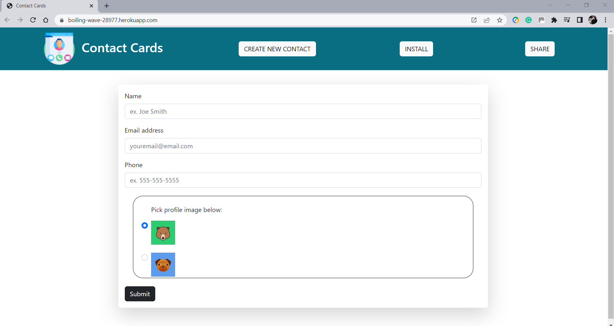
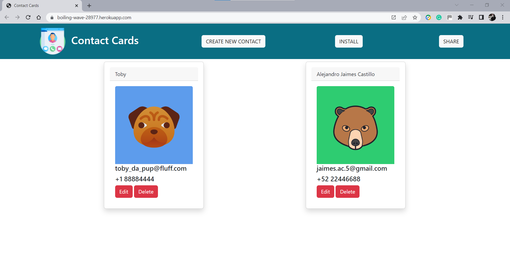
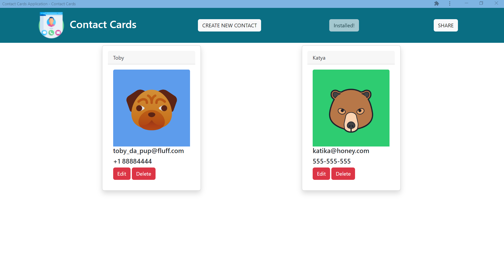

# Contact Cards Application

## Table of Contents

- [Project Description](#Project-Description)
- [User Story](#User-Story)
- [Screen Captures](#Screen-Captures)
- [Technologies](#Technologies)
- [Links](#Links)


## Project Description

A Progressive Web Application (PWA) of a Contact Cards application. This app allows users to store contact information and profile pics and add, edit, and delete the information as needed in a convenient single-page application that can be used on any device.

The application implements the client-server model built with HTML, CSS, and JavaScript. Then, using webpack to bundle JavaScript modules, the app's speed and performance are improved. After that, using IndexededDB web API, the app's data becomes persistent in the browser. Service worker functionality is then generated and registered to enable offline functionality. Finally, a ``` manifest.json ``` is added to the app to give the user a fast, network-independent experience that works on any device.

###### [Back to Index](#Table-of-Contents)


## User Story

```
As a developer I want to:
- See the client-server folder structure.
- Integrate webpack into the client directory.
- Configure the application to use IndexedDB.
- Add service worker using Workbox.
- Configure the Contact Cards application to be installable by the end user.
```

###### [Back to Index](#Table-of-Contents)


## Screen Captures







###### [Back to Index](#Table-of-Contents)


## Technologies


###### [Back to Index](#Table-of-Contents)


## Links

- [Deployed Application](https://boiling-wave-28977.herokuapp.com/)

###### [Back to Index](#Table-of-Contents)